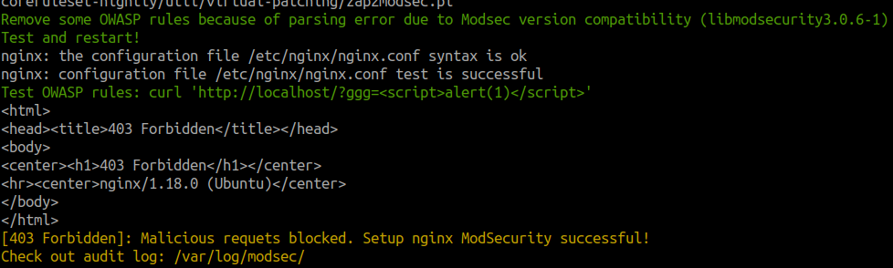

# Simple ModSecurity NGINX Setup + OWASP CRS Setup

Simple bash script to automatically install and setup ModSecurity nginx and add OWASP Core Rule Set (CRS)

This script builds upon nginx version `1.18.0` with already compiled `libmodsecurity3` and `ModSecurity nginx connector` so it doesn't require to compile both modules from source, which take alot of time and resources
## Compatibility
Tested again `Ubuntu 22.04.2 LTS`

## setup-modsec-nginx.sh
This script will:
1. Install nginx `1.18.0`
2. Install `libmodsecurity3` via `apt install`
3. Setup nginx modsecurity configuration with `ModSecurity nginx connector` from compiled binary above
4. Install OWASP Core Rule Set for ModSecurity 3
5. Enable & Test


## Usage
Just run:
```bash
sudo bash setup-modsec-nginx.sh
```

Example setup success:


